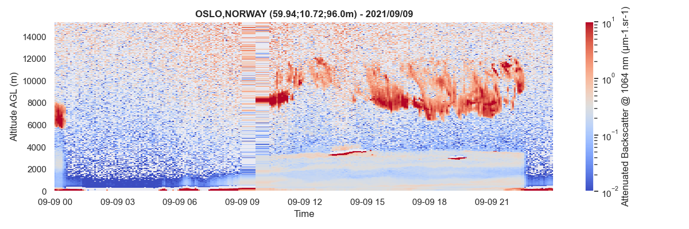
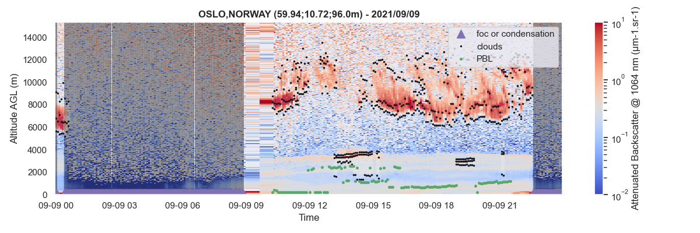
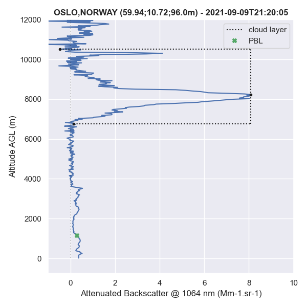

[](https://github.com/AugustinMortier/A-Profiles/actions/workflows/ci.yml)
[](https://a-profiles.readthedocs.io/en/latest/?badge=latest)
[]([https://<username>.github.io/<repository-name>/](https://augustinmortier.github.io/a-profiles/))
[](https://codecov.io/gh/AugustinMortier/A-Profiles)


Python library for reading and processing ALC (Automated Lidars and Ceilometers) measurements. A-Profiles supports [E-PROFILE](https://e-profile.eu/#/cm_profile) ceilometer data. This library is used by [V-Profiles](https://vprofiles.met.no).

## 📗 Documentation
The official documentation is available [here](https://augustinmortier.github.io/a-profiles/).

## ✨ Installation

###  via *pip*
*aprofiles* is directly available on *pip*. This will install the latest released version of *aprofiles* and its depencencies.

- with *pip*

`pip install aprofiles`

- with *pipx*

`pipx install aprofiles`

###  from source
1. clone this repository

    `git clone https://github.com/AugustinMortier/A-Profiles.git`

2. installation
   - with *pip* (>21.3)

       `pip install .`
    
    - with *pipx*

       `pipx install .`

   - with *poetry*
  
       `poetry install`


In order to install directly the package from source with pip, you can also use the combined command

`pip install "git+ssh://git@github.com/AugustinMortier/A-Profiles.git"`

## 🚀 Get started

### Reading Data
```
# import library
import aprofiles as apro

# read local NetCDF L2 data
path = "examples/data/E-PROFILE/L2_0-20000-006735_A20210908.nc"
profiles = apro.reader.ReadProfiles(path).read()
``` 

### Basic corrections and Image plotting
``` 
# extrapolate lowest layers for removing outliers
profiles.extrapolate_below(z=150, inplace=True)

# image plotting of backscatter signal in log scale
profiles.plot(zref='agl', vmin=1e-2, vmax=1e1, log=True)
``` 



### Profiles Analysis
```
# fog/condensation detection
profiles.foc(zmin_cloud=200) 

# clouds detection
profiles.clouds(zmin=300, thr_noise=5, thr_clouds=4)

# planetary boundary layer
profiles.pbl(zmin=200, zmax=3000, under_clouds=True)
```

### Visualization

#### Image
```
# image plotting with additional retrievals
profiles.plot(show_fog=True, show_clouds=True, show_pbl=True, vmin=1e-2, vmax=1e1, log=True)
```


##### Single Profile
```
# plot single profile at 21:20
datetime = np.datetime64('2021-09-09T21:20:00')
profiles.plot(datetime=datetime, vmin=-1, vmax=10, zmax=12000, show_clouds=True, show_pbl=True)
```


## ⚖️ License
[GPL-3.0](LICENSE).

## 🎓 Support
*A-Profiles* is developed by [MET Norway](https://github.com/metno) and supported by [EUMETNET](https://www.eumetnet.eu/).
