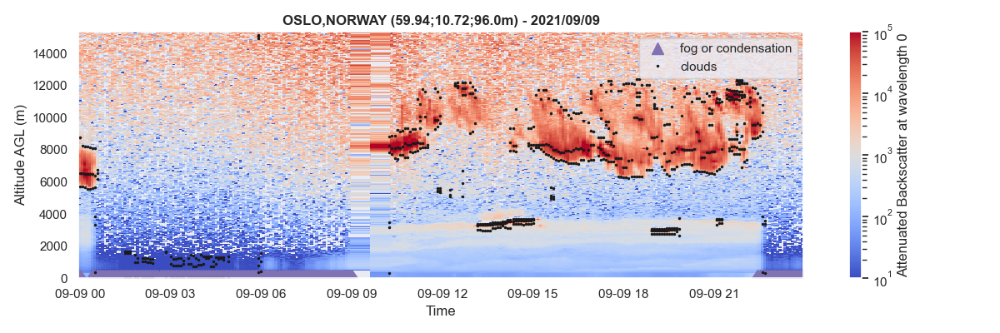

# A-Profiles

Python library for reading and processing [E-PROFILE](https://e-profile.eu/#/cm_profile) ceilometer data. This library is used by [V-Profiles](https://aerocom-vprofiles.met.no).

## Documentation
The official documentation is available [here](https://a-profiles.readthedocs.io/).

## Installation
`pip install aprofiles`

## Get started

### Reading Data
```
#import library
import aprofiles as apro

#read local NetCDF L2 data
path = "examples/data/L2_0-20000-006735_A20210908.nc"
apro_reader = apro.reader.ReadProfiles(path)
profiles = apro_reader.read()
``` 

### Basic corrections and Image
``` 
#apply range correction
profiles.range_correction(inplace=True)

#extrapolate lowest layers for removing outliers
profiles.extrapolation_lowest_layers(zmin=300, inplace=True)

#image plotting of backscatter signal in log scale
profiles.plot(var="attenuated_backscatter_0", vmin=1e0, vmax=1e5, log=True)
``` 


### Profiles Analysis
```
#Fog/condensation detection
profiles.detect_fog_or_condensation()

#Clouds detection
profiles.detect_clouds(time_avg=15, zmin=300, thr_noise=5, thr_clouds=4)
```

### Visualization

#### Image
```
#image plotting with additional retrievals
profiles.plot(show_fog=True, show_clouds=True, vmin=1e1, vmax=1e5, log=True)
```


##### Single Profile
```
#Plot single profile at 19:25
profiles.plot(time=np.datetime64('2021-09-09T19:25:00'), show_fog=True, show_clouds=True, log=False)
```
