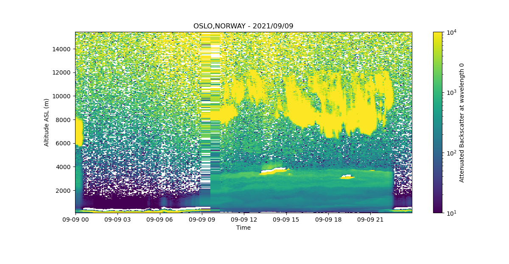

### A-Profiles

Python library for reading and processing [E-PROFILE](https://e-profile.eu/#/cm_profile) ceilometer data. This library is used by [V-Profiles](https://aerocom-vprofiles.met.no).

## Installation
`pip install aprofiles`

## Get started
```
#import library
import aprofiles as apro

#read NetCDF data
path = "data/e-profile/2021/09/08/L2_0-20000-006735_A20210908.nc"
apro_reader = apro.reader.ReadProfiles(path)
profiles = apro_reader.read()

#apply range correction
profiles.range_correction(inplace=True)
#apply some gaussian filter for reducing the instrumental noise
profiles.gaussian_filter(sigma=0.5, inplace=True)
#plot Quick Look
profiles.quickplot(log=True, vmin=10, vmax=1e4, cmap='viridis')

profiles.quickplot('attenuated_backscatter_0',vmin=0, vmax=2, cmap='viridis')
``` 

