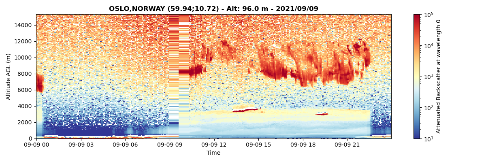
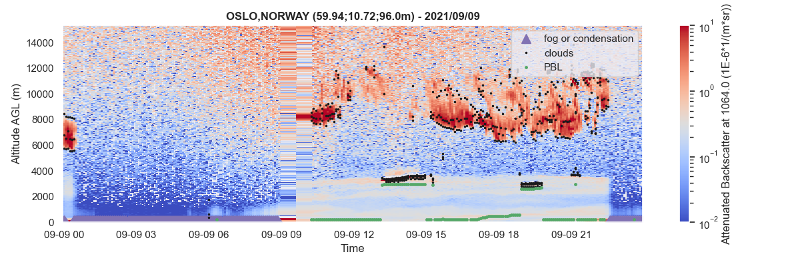
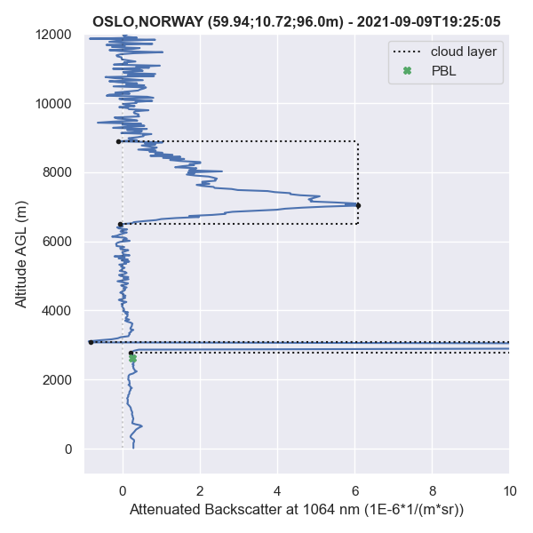

# A-Profiles

Python library for reading and processing atmospheric profilers measurements. A-Profiles supports [E-PROFILE](https://e-profile.eu/#/cm_profile) ceilometer data. This library is used by [V-Profiles](https://aerocom-vprofiles.met.no).

## Documentation
The official documentation is available [here](https://a-profiles.readthedocs.io/).

## Installation
`pip install aprofiles`

## Get started

### Reading Data
```
#import library
import aprofiles as apro

#read local NetCDF L2 data
path = "examples/data/L2_0-20000-006735_A20210908.nc"
apro_reader = apro.reader.ReadProfiles(path)
profiles = apro_reader.read()
``` 

### Basic corrections and Image plotting
``` 
#extrapolate lowest layers for removing outliers
profiles.extrapolate_below(zmin=150, inplace=True)

#image plotting of backscatter signal in log scale
profiles.plot(zref='agl', vmin=1e-2, vmax=1e1, log=True)
``` 



### Profiles Analysis
```
#Fog/condensation detection
profiles.foc(zmin_cloud=200) 

#Clouds detection
profiles.clouds(zmin=300, thr_noise=5, thr_clouds=4)

#Planetary Boundary Layer
profiles.pbl(zmin=200, zmax=3000, under_clouds=True)
```

### Visualization

#### Image
```
#image plotting with additional retrievals
profiles.plot(show_fog=True, show_clouds=True, show_pbl=True, vmin=1e-2, vmax=1e1, log=True)
```


##### Single Profile
```
#Plot single profile at 19:25
datetime = np.datetime64('2021-09-09T19:25:00')
profiles.plot(datetime=datetime, vmin=-1, vmax=10, zmax=12000, show_clouds=True, show_pbl=True)
```

