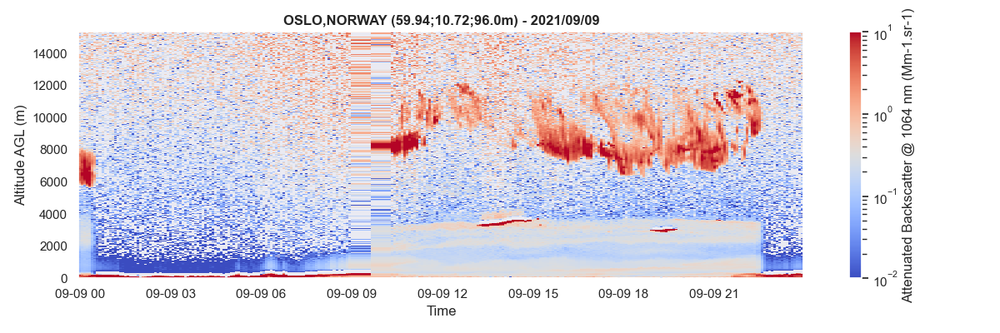
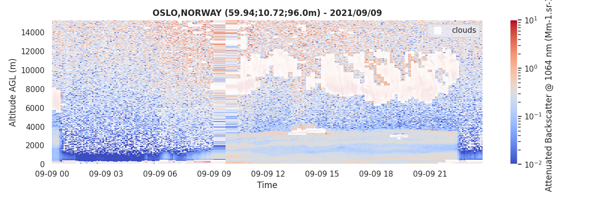
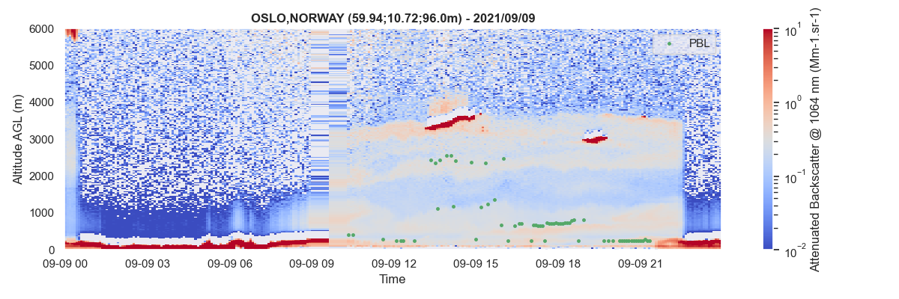

# Examples

:simple-rocket:{ style="text-align: center; font-size: xx-large; display: block" }

Some basic examples for getting you started using *aprofiles*. For more
information, check out the `API`{.interpreted-text role="ref"}.

## Data reading

For reading ceilometers and lidars data, the [`ReadProfiles`](api/reading.md#aprofiles.reader) class must be instantiated with the path of the NetCDF file to be read. The [`read()`](api/reading.md#aprofiles.reader.ReadProfiles.read) method applied to this instance returns a [`ProfilesData`](api/data_classes.md#aprofiles.profiles.ProfilesData) object whose `data` attribute contains the NetCDF file content as a [`xarray.Dataset`](https://docs.xarray.dev/en/stable/generated/xarray.Dataset.html).


```python
{!../examples/01_data_reading.py!}
```


## Basic corrections

Here is a non exhaustive list of basic corrections available to correct
profile measurements.

### Extrapolation lowest layers

It is frequent to observe negative values in the lowest layers of the profiles due to instrumental artifacts. It is recommended to eliminate those outliers prior to detecting parameters such as the planetary boundary layer height or before retrieving the aerosol profiles. The [`extrapolate_below()`](api/detection.md#aprofiles.profiles.ProfilesData.extrapolate_below) method of the [`ProfilesData`](api/data_classes.md#aprofiles.profiles.ProfilesData) class allows you to extrapolate values of the selected variable of a [`ProfilesData`](api/data_classes.md#aprofiles.profiles.ProfilesData) object.


```python
{!../examples/02_01_extrapolation.py!}
```


### Gaussian Filtering

The application of a Gaussian filter can help increase the SNR (which can be determined with the [`snr()`](api/detection.md#aprofiles.profiles.ProfilesData.snr) method).



```python
{!../examples/02_02_gaussian_filtering.py!}
```

![Backscatter profiles with gaussian filter ([sigma=0.5]{.title-ref})](assets/images/gaussian_filter.png)

## More advanced detection

### Fog or condensation detection

Fog or condensation prevents the laser beam from propagating into the atmosphere. It is important to detect these cases to filter the data when trying to quantify the aerosol content. The default method of [`foc()`](api/detection.md#aprofiles.profiles.ProfilesData.foc) relies on the constructor's cloud detection, which provides cloud bases.

```python
{!../examples/03_01_foc.py!}
```


### Clouds detection

The clouds module aims to detect clouds in each single profiles,
individually. This detection relies on the analysis of the vertical
gradient of the attenuated backscatter profiles.

```python
{!../examples/03_02_clouds.py!}
```



### Planetary Boundary Layer tracking

The Planetary Boundary Layer module identifies the PBL heigh as the
strongest vertical gradient of the attenuated backscatter profiles.

```python
{!../examples/03_03_pbl.py!}
```



## Aerosol retrieval

### Extinction

The aerosol extinction module retrieves extinction profiles by using a
prescribed a priori (Lidar ratio, or AOD). Both backward and forward
methods have been implemented and can be used in this module.

```python
{!../examples/04_01_extinction.py!}
```


### Concentration

Aerosol mass concentration is calculated by [`inversion()`](api/data_classes.md#aprofiles.profiles.ProfilesData.inversion), if `mass_conc=True` (default), for different aerosol types when calculating the extinction profiles. Together with `extinction`, other variables are added to the instance of the [`ProfilesData`](api/data_classes.md#aprofiles.profiles.ProfilesData) class: `mass_concentration:[aer_type]`.


```python
{!../examples/04_02_mass_concentration.py!}
```


