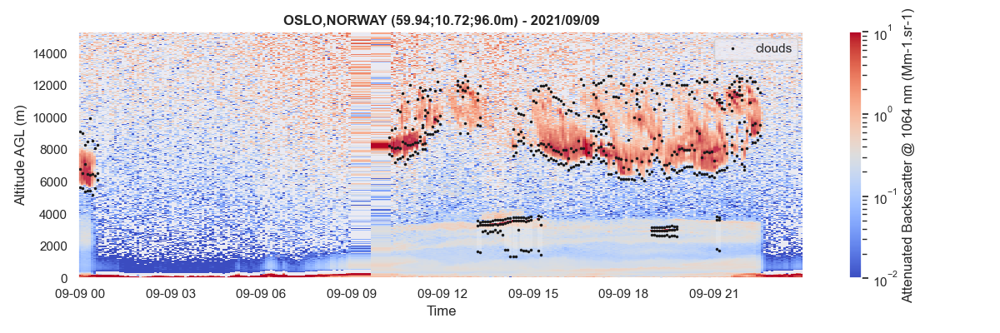

{.awesome-svg .awesome-svg}

Some basic examples for getting you started using *aprofiles*. For more
information, check out the `API`{.interpreted-text role="ref"}.

Data reading
============

For reading ceilometers and lidars data, the
`~aprofiles.reader.ReadProfiles`{.interpreted-text role="class"} class
must be instantiated with the path of the NetCDF file to be read. The
`~aprofiles.reader.ReadProfiles.read()`{.interpreted-text role="meth"}
method applied to this instance returns a
`~aprofiles.profiles.ProfilesData`{.interpreted-text role="class"}
object whose [data]{.title-ref} attribute contains the NetCDF file
content as a `xarray.Dataset`{.interpreted-text role="class"}.

```python
{!../examples/01_data_reading.py!}
```


Basic corrections
=================

Here is a non exhaustive list of basic corrections available to correct
profile measurements.

Extrapolation lowest layers
---------------------------

It is frequent to observe negative values in the lowest layers of the
profiles due to instrumental artifacts. It is recommended to eliminate
those outliers prior to detect some parameters such as the planetary
boundary layer height, or before retrieving the aerosol profiles. The
`~aprofiles.profiles.ProfilesData.extrapolate_below()`{.interpreted-text
role="meth"} method of the
`~aprofiles.profiles.ProfilesData`{.interpreted-text role="class"} class
allows to extrapolate values of the selected variable of a
`aprofiles.profiles.ProfilesData`{.interpreted-text role="class"}
object.


```python
{!../examples/02_01_extrapolation.py!}
```


Gaussian Filtering
------------------

The application of a gaussian filter can help increasing the SNR (that
can be determined with the
`~aprofiles.profiles.ProfilesData.snr()`{.interpreted-text role="meth"}
method).


```python
{!../examples/02_02_gaussian_filtering.py!}
```

![Backscatter profiles with gaussian filter
([sigma=0.5]{.title-ref})](assets/images/gaussian_filter.png)

More advanced detection
=======================

Fog or condensation detection
-----------------------------

Fog or condensation prevents the laser beam to propagate into the
atmosphere. It is important to detect those cases for filtering the data
when trying to quantifying the aerosol content. The default method of
`~aprofiles.profiles.ProfilesData.foc()`{.interpreted-text role="meth"}
relies on the constructor clouds detection, which provides clouds bases.

```python
{!../examples/03_01_foc.py!}
```


Clouds detection
----------------

The clouds module aims to detect clouds in each single profiles,
individually. This detection relies on the analysis of the vertical
gradient of the attenuated backscatter profiles.

```python
{!../examples/03_02_clouds.py!}
```



Planetary Boundary Layer tracking
---------------------------------

The Planetary Boundary Layer module identifies the PBL heigh as the
strongest vertical gradient of the attenuated backscatter profiles.

```python
{!../examples/03_03_pbl.py!}
```


Aerosol retrieval
=================

Extinction
----------

The aerosol extinction module retrieves extinction profiles by using a
prescribed a priori (Lidar ratio, or AOD). Both backward and forward
methods have been implemented and can be used in this module.

```python
{!../examples/04_01_extinction.py!}
```


Concentration
-------------

Aerosol mass concentration is calculated by
`~aprofiles.profiles.ProfilesData.inversion`{.interpreted-text
role="meth"}, if [mass\_conc=True]{.title-ref} (default), for different
aerosol types when calculating the extinction profiles. Together with
[extinction]{.title-ref}, other variables are added to the instance of
the `~aprofiles.profiles.ProfilesData`{.interpreted-text role="class"}
class: [mass\_concentration:\[aer\_type\]]{.title-ref}

```python
{!../examples/04_02_mass_concentration.py!}
```


