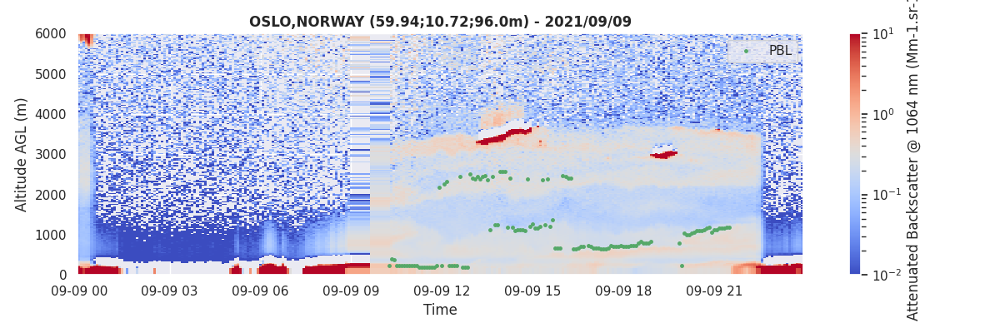
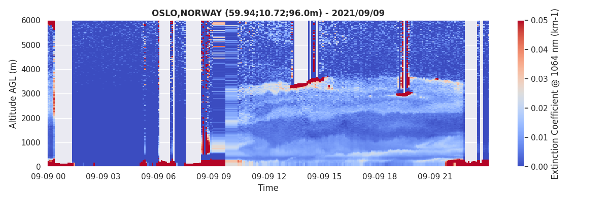

Examples
======================================

Some basic examples for getting you started using *aprofiles*.

Data reading
------------

For reading ceilometers and lidars data, the class :class:`aprofiles.reader.ReadProfiles` must be instantiated with the path of the NetCDF file to be read.
The :func:`aprofiles.reader.ReadProfiles.read()` method applied to this instance returns a :class:`aprofiles.profiles.ProfilesData` object whose `data` attribute contains the NetCDF file content as a :class:`xarray.DataSet`.

.. literalinclude:: ../examples/01_data_reading.py
.. figure:: ../examples/images/attenuated_backscatter.png
   
      Attenuated Backscatter Profiles

Basic corrections
-----------------

Here is a non exhaustive list of basic corrections available to correct profile measurements. For more information, check out the :ref:`API`.

Extrapolation lowest layers
^^^^^^^^^^^^^^^^^^^^^^^^^^^

It is frequent to observe negative values in the lowest layers of the profiles due to instrumental artifacts.
It is recommended to eliminate those outliers prior to detect some parameters such as the planetary boundary layer height, or before retrieving the aerosol profiles.
The :func:`aprofiles.profiles.ProfilesData.extrapolate_below()` method allows to extrapolate values of the selected variable of a :class:`aprofiles.profiles.ProfilesData` object.

.. figure:: ../examples/images/lowest.png

      Negative values are observed in the lowest layers

.. literalinclude:: ../examples/02_01_extrapolation.py
.. figure:: ../examples/images/lowest_extrap.png

      Extrapolation below 150m of altitude

Gaussian Filtering
^^^^^^^^^^^^^^^^^^

The application of a gaussian filter can help increasing the SNR (that can be determined with the :func:`aprofiles.profiles.ProfilesData.snr()` method).

.. figure:: ../examples/images/attenuated_backscatter.png

      Original attenuated backscatter profiles

.. literalinclude:: ../examples/02_02_gaussian_filtering.py
.. figure:: ../examples/images/gaussian_filter.png

      Backscatter profiles with gaussian filter (`sigma=0.5`)

More advanced detection
-----------------------

For more information on the methods parameters, please check out the :ref:`API`.

Fog or condensation detection
^^^^^^^^^^^^^^^^^^^^^^^^^^^^^

Fog or condensation prevents the laser beam to propagate into the atmosphere. It is important to detect those cases for filtering the data when trying to quantifying the aerosol content.
The default method of the :func:`aprofiles.profiles.ProfilesData.foc()` method relies on the constructor clouds detection which provides clouds bases.

.. literalinclude:: ../examples/03_01_foc.py
.. figure:: ../examples/images/foc.png

      Fog or Condensation detection

Clouds detection
^^^^^^^^^^^^^^^^

The clouds module aims to detect clouds in each single profiles, individually. This detection relies on the analysis of the vertical gradient of the attenuated backscatter profiles.

.. literalinclude:: ../examples/03_02_clouds.py

      Clouds detection

Planetary Boundary Layer tracking
^^^^^^^^^^^^^^^^^^^^^^^^^^^^^^^^^

The Planetary Boundary Layer module identifies the PBL heigh as the strongest vertical gradient of the attenuated backscatter profiles.

.. literalinclude:: ../examples/03_03_pbl.py

      Planetary Boundary Layer height detection

Aerosol retrieval
-----------------

Extinction
^^^^^^^^^^

The aerosol extinction module retrieves extinction profiles by using a prescribed a priori (Lidar ratio, or AOD).
Both backward and forward methods have been implemented and can be used in this module.

.. literalinclude:: ../examples/04_01_extinction.py

      Aerosol extinction profiles retrieved with an iterative forward approach.

Mass concentration
^^^^^^^^^^^^^^^^^^

Coming soon